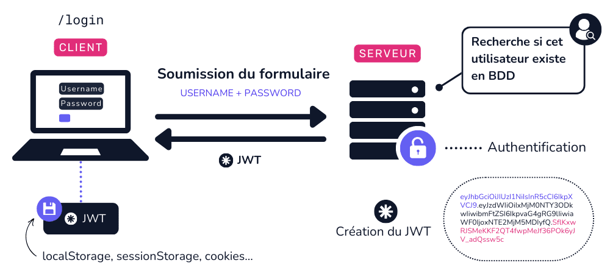

# Mes notes 
## Author : Yousra Chbib
## 
### Attaques
1. **Menaces**

|Menaces|Explication|Exemple|
|-------|-----------|-------|
|**Compromission des ressources**|*Prendre le contrôle des données ou des services d'un site*|accéder à la base de données et/ou modifier des fichiers importants|
|**Le déni de service DoS/DDoS**|*Rendre un site web/app inutilisable en saturant le serveurs de requêtes, ce qui le bloque*|**DDoS**(un grand nombre de machines `botnets` attaquent en même temps) |
|**Le vol de données**|*Accéder à des informations sensible*|accéder à une base de données et voler les données personnelles des utilisateurs|

2. **Classes d'attaques**

|Nom de la classe|Explication|Exemple|
|----------------|-----------|-------|
|**Cross-Site-Scripting (XSS)**|*Attaquer les utilisateurs d'une page web en injectant du code malveillant dans cette page, afin qu'il soit exécuté par leurs navigateurs.*|Injecter du code JavaScript dans un champ de commentaire.|
|**Cross-Site-Request-Foregery (CSRF)**|*Forcer l'utilisateur à faire une action sur un site où il est déja connecter sans qu'il le sache*|L'utilisateur clique sur un lien piégé alors qu'il est connecté à sa banqhue, une requête vas etre envoyer à la banque pour un virement, -comme il est déja connecté- la banque l'accepte|
|**Server-Side-request-Foregery (SSRF)**|*Forcer un serveur à faire des requêtes vers des recources interne et/ou externe*|L'attaquant envoie une requête cencé de récupérer un image, mais il a détourner pour accéder à des ressources internes et récupérer des données sensibles|
|**SQLi**|*Insérer du code SQL malveillant dans une entrée utilisateur pour manipuler une base de donner  des données malveillantes dans un champ de formulaire pour tromper la base de données et lui faire executer des commandes non prévues*|Envoyer une requête SQL malveillante pour se connecter à un site `Select from users WHERE name'toto' and password ='tutu' OR '1'=1` comme 1=1 est toujours vrais, le site donne accés à tous les comptes|
|**Local/Remote file inclusion**|*Forcer un site à charger un fichier provient ou bien du serveur lui même ou d'un serveur externe*|Charger un fichier local sensible (mots de passe...) du serveur|
|**XML External Entity (XXE)**|*exploite une mauvaise configuration du traitement XML pour accéder à des fichiers sensibles du serveur ou exécuter d'autres actions malveillantes.*|Envoyer un fichier XML contenant une entité externe pour que le serveur renvoie le contenu d'un fichier sensible.|

### Régles d'hygiène : 
|Principe de sécurité|Description|Exemples|
|--------------------|-----------|--------|
|**Défence en Profondeur**|*Utilisation de plusieurs couches de sécurité indépendantes pour protéger un système.*|Ne pas concentrer toutes les mesures de sécurité au point d’entrée, chaque composant doit intégrer ses propres protections.|
|**Moindre Privilège**|*Limiter les permissions aux seules nécessaires pour minimiser les risques en cas de compromission.*|Définir des rôles précis (lecture seule, écriture…), restreindre les permissions d’accès aux API et aux fichiers système.|
|**Réduction de la surface d'attaque**|*Ne pas exposer de services, accès ou composants inutiles pour limiter les vulnérabilités.*|Filtrage des ports réseau, désactivation des services non nécessaires, suppression des modules inutiles.|

### TLS 
**C'est quoi ?**
*TLS (Transport Layer Security) est un protocole de sécurité utilisé pour chiffrer les communications entre un serveur et un client.*
*Lorsque on vois `HTTPS` dans l'URL d'un site, cela signifie que TLS est utilisé pour sécuriser la connexion.*

### Pourquoi l'utiliser ?
- Protège la confidentialité des données échangées entre le site et l'utilisateur.
- Empêche les attaques `Man-In-The-Middle`*, où un attaquant pourrait intercepter ou modifier les informations.

### Bonne Pratiques 
- Utiliser `TLS 1.2` ou `1.3` pour garantir une sécurité optimale.
- Activer `HSTS`* pour forcer l'utilisation de HTTPS et empêcher l'accès en HTTP non sécurisé.
- Surveiller les `CT`* logs pour détecter et révoquer les certificats frauduleux.

|Termes|Définition|
|------|----------|
|**Man-In-The-Middle**|*Une attaque où un attaquant intercepte, modifie ou espionne les communications entre deux parties (par exemple, un utilisateur et un site web) sans qu'elles ne s'en aperçoivent.*|
|**HSTS (HTTP Strict Transport Security)**|*Une mesure de sécurité qui force les navigateurs à n'utiliser que HTTPS pour se connecter à un site web.*|
|**CT Logs (Certificate Transparency Logs)**|*Ce sont des registres publics qui enregistrent tous les certificats SSL/TLS délivrés pour un site web. *|

### Mécanismes de Sécurité Web  
1. Stratégie par défaut : 
 
| Stratégie | Explication  | Pourquoi ? | Exemple  |
|-----------|--------------|------------|----------|
| **Same-Origin Policy (SOP)**    | Bloque l’accès aux ressources d’un site par un autre site si leur origine (protocole, domaine, port) est différente. | Empêche les attaques où un site malveillant tenterait de lire des données sensibles depuis un autre site sans autorisation. | Un script sur `malicious.com` ne peut pas accéder aux cookies d'`exemple.com`, sauf si `exemple.com` l’autorise explicitement. |
| **Cross-Origin Resource Sharing (CORS)** | Permet à un site d’accéder aux ressources d’un autre domaine si ce dernier l’autorise via des en-têtes HTTP. | Contourne les restrictions SOP de manière sécurisée en permettant des communications légitimes entre sites. | Une API sur `api.exemple.com` autorise `www.exemple.com` à récupérer ses données. |
| **Content Security Policy (CSP)** | Restreint le chargement de scripts, images, styles, etc., pour éviter les attaques XSS et autres injections. | Protège contre l’exécution de scripts malveillants en limitant les sources autorisées à fournir du contenu. | Un site définit empêcher l’exécution de scripts non autorisés. |

| **Mécanisme de sécurité** |**Explication**|
|---------------------------|---------------|
| **Protection contre les vulnérabilités XSS**   | XSS (Cross-Site Scripting) permet à un attaquant d'injecter du code malveillant dans une page web. Pour s'en protéger, on filtre les entrées utilisateur pour éviter l'injection. |
| **Content Security Policy (CSP)**              | CSP est une politique de sécurité qui permet de contrôler les sources de contenu autorisées (comme les scripts, images, etc.) pour empêcher l'exécution de code malveillant.    |
| **Referrer-Policy**                            | Referrer-Policy définit quelles informations (comme l'URL complète) sont envoyées dans les en-têtes HTTP lors des navigations, pour protéger la vie privée de l'utilisateur.      |
| **Web Storage, IndexedDB, Cookies**            | Ces technologies stockent des données côté client. Web Storage et IndexedDB permettent de stocker des informations locales, tandis que les cookies gardent des informations sur l'utilisateur. |
| **XMLHttpRequest (XHR) et Cross-Origin Resource Sharing (CORS)** | XHR est utilisé pour faire des requêtes HTTP sans recharger la page. CORS est une politique qui définit si un site peut accéder à des ressources d'un autre domaine.            |
| **HTML5 et JavaScript**                        | HTML5 et JavaScript permettent de créer des pages interactives et dynamiques. Ils sont utilisés dans des applications web modernes, mais doivent être sécurisés pour éviter les attaques. |

### Conlusion :

*Ce guide permer de mieux comprendre les différents mécanismes de sécurité à mettre en place pour protéger les applications web. En appliquant des techniques comme la protection contre les attaques XSS, l'utilisation de la CSP, et la gestion des cookies ou du stockage local, on peut renforcer la sécurité des sites. on voit aussi l'importance de mettre en œuvre CORS et la Referrer-Policy pour mieux gérer la confidentialité et l'intégrité des données.Ces mesures doivent être intégrées dès le début du développement pour garantir une sécurité maximale.*
----

## Authentification et Sécurité des Mots de Passe :
- Sécuriser l'accès aux comptes et systèmes.
- Limiter les risques de piratage(mots de passe ..).
- Donner les bonnes pratique pour une authetification robuste.

 *les jetons JWT peuvent être chiffrés pour protéger les données sensibles, garantissant ainsi que seuls les destinataires prévus peuvent lire le contenu du jeton .*

1. Authentification: 
    - Moyens d'authentification: sont des éléments connus ou possédés uniquement par le prouveur,(Mot de passe, Donnée biométrique..)

2. Bonnes pratiques pour les mots de passe :
    - Minimum 12-14 caractères(Longueur/complexité).
    - Éviter les mots communs,infos personnelles, ou réutiliser un mot de passe.
    - Stockage sécurisé (Hachage,coffre-fort(Keepass..), Ne pas forcer le changement fréquent )

3.  Menaces et attaques sur l'authentification : 
*La menace principale contre l'authentification est `l'usurpation d'identité`, où un attaquant se fait passer pour un utilisateur légitime.*, deux types d'attaquants sont distingués: 
    - **Attaquant en ligne** : interagit avec le serveur d'authentification pour tenter de retrouver des valeurs secrètes, comme un mot de passe ou une clé privée.
    - **Attaquant hors ligne** :  accès aux données de l'authentification, comme des empreintes de mots de passe ou une clé publique.

4. Menaces et attaques sur les facteurs de connaissance :

    |Menace|Protection|
    |------|----------|
    |**Attaque par recherche exhaustive** L'attaquant teste toutes les combinaisons possibles de caractères.|Limiter le nombre d'essais|
    |**Attaque par dictionnaire** L'attaquant teste les mots d'un dictionnaire pour deviner le mot de passe.|Mots de passe robustes, coffre-fort de mots de passe|
    |**Attaque par tables pré-calculées** (`rainbow tables`) Les attaquants comparent les empreintes cryptographiques volées avec une empreinte pré-calculée|Utilisation de sel aléatoire long|
    |**Attaque par ingénierie sociale** L'attaquant cherche à obtenir des informations sensibles par des moyens détournés, comme l'hameçonnage.|Authentification multifacteur|

5. Menaces et attaques sur les facteurs de possession
Les menaces sur les facteurs de possession incluent le vol, la perte, ou la compromission de l'équipement contenant le facteur (ex: carte à puce). Les attaquants cherchent à récupérer des informations sensibles via des attaques par canaux auxiliaires.

6. Menaces et attaques sur les facteurs 
Les facteurs biométriques sont également vulnérables à des attaques visant à usurper l'identité physique de l'utilisateur. Les attaques peuvent inclure la présentation de photos, vidéos préenregistrées, ou encore des moulages d'empreintes digitales.

7. Limite d'authentification par mots de passe
    - Mémorisation difficile; utilisation de mots simples ou réutilisation.
    - Faciles à casser (dates, mots du dictionnaire..).
    - Mots de passe robustes : Longs et complexes mais difficiles à mémoriser.
    - Coffres-forts de mots de passe : Solutions de stockage sécurisé, mais vulnérables aux attaques par `hameçonnage` et logiciels malveillants (keyloggers).
    - Si un même mot de passe est utilisé partout, les fuites de bases de données peuvent exposer de nombreux comptes.

8. Protocoles d’authentification forte :
    - Défi-réponse : Clé secrète + défi variable (ex. Kerberos..).
    - Résistance aux attaques : écoute clandestine, rejeu, MAN-IN-THE-MIDDLE.

## les recommandations concernant le cycle de vie des facteurs d'authentification :
|Création et renouvellement des facteurs d'authentification|Explication|
|------|-----|
|**Environnement contrôlé**|Les facteurs doivent être créés dans un environnement sécurisé. Par exemple, l'enregistrement d'une carte à puce pourrait se faire sur un poste déconnecté avec une remise en main propre pour vérification d'identité |
|**Génération aléatoire**|Il est crucial d'utiliser des générateurs de nombres aléatoires robustes pour garantir la sécurité des éléments |
|**Canaux sécurisés pour la remise**|Les facteurs doivent être remis à l'utilisateur via des canaux sécurisés. Si la remise se fait à distance, elle doit respecter des standards de sécurité, garantissant l'intégrité, l'authenticité et la confidentialité |
|**Renouvelement**| Il est recommandé d'avoir un processus structuré de renouvellement des facteurs d'authentification, simplifiant la procédure tout en maintenant un contrôle de sécurité |

## Transmission et utilisation des facteurs d'authentification
1. **Eviter les SMS** : 
*Le SMS n’est pas un canal sécurisé pour la transmission de facteurs d'authentification, car il peut être intercepté ou victime de l’attaque SIM swapping.*
2. **Journalisation des événements** : 
*Il est essentiel de conserver un historique des événements liés à l’authentification, permettant ainsi une détection d’anomalies ou de compromissions.*
3. **Limiter les tentatives d’authentification** : 
*Pour éviter les attaques par force brute, il est recommandé de limiter les tentatives d’authentification et de mettre en place un délai après plusieurs échecs.*
4. **Utilisation de canaux sécurisés** : 
*Tous les échanges contenant des secrets d'authentification doivent être réalisés via des canaux sécurisés tels que TLS.*
- **Durée des sessions** : 
*La durée des sessions authentifiées doit être limitée pour réduire les risques d'exploitation par un attaquant en cas de session compromise.*

