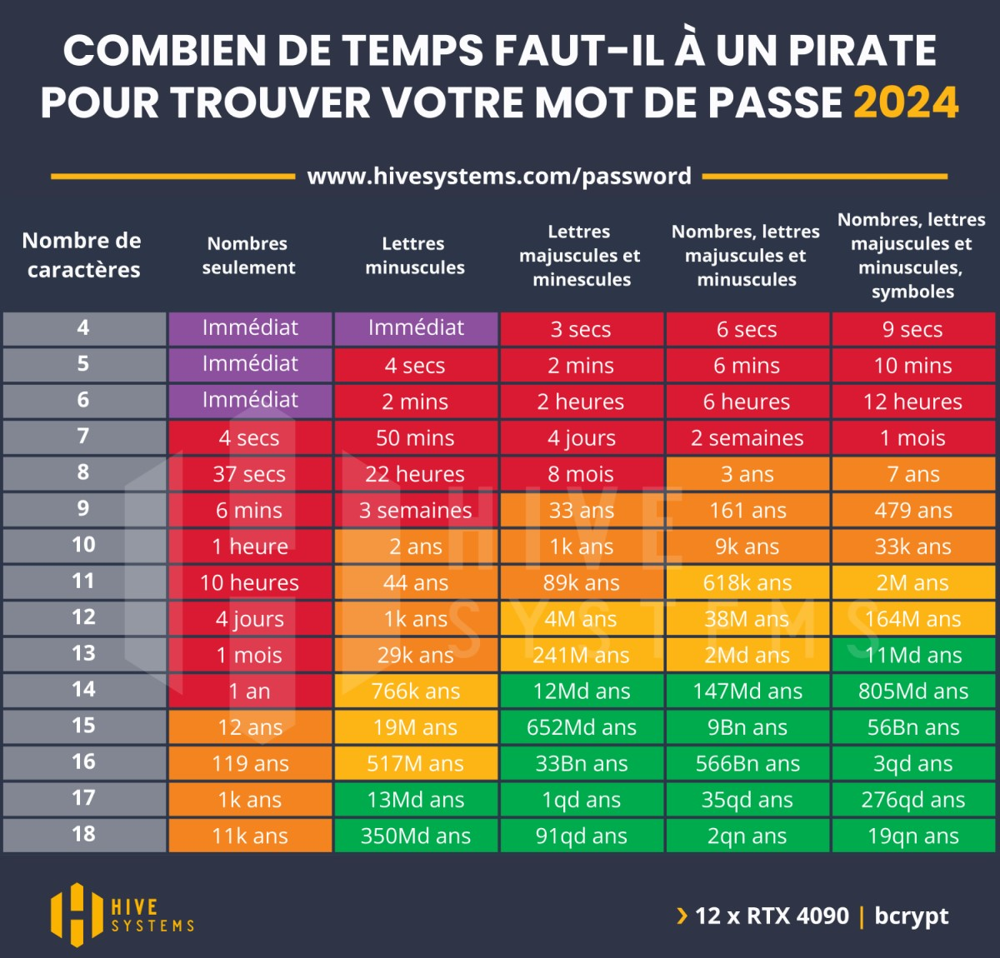

# La sécurité des mots de passe
## Longueur et Complexité des Mots de Passe
1. **Longueur Minimale** :   
Imposer une longueur minimale de 12 caractères pour chaque mot de passe. 
2. **Complexité** :  
 Exiger l'utilisation de majuscules, minuscules, chiffres et caractères spéciaux. 
## Interdiction des Informations Personnelles
Empêcher l'utilisation d'informations personnelles facilement devinables, telles que des noms, des dates de naissance ou des mots courants.

## Gestionnaire de Mots de Passe
Recommander l'utilisation de gestionnaires de mots de passe pour générer et stocker des mots de passe complexes de manière sécurisée.

## Changement  des Mots de Passe 
Bien que le changement fréquent des mots de passe ne soit plus systématiquement recommandé, il est crucial de le faire immédiatement en cas de suspicion de compromission.

## Vérification des Fuites de Données
Intégrer des outils permettant de vérifier si les mots de passe des utilisateurs ont été compromis lors de fuites de données précédentes.

## Conclusion Concrete : 
  
*https://www.francenum.gouv.fr/magazine-du-numerique/combien-de-temps-un-pirate-met-il-pour-trouver-votre-mot-de-passe-comment*