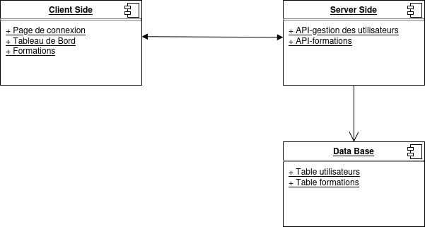

# Notes pour le Rapport
## Author : Yousra Chbib
## Projet de plateforme de formation :

## Notes à mettre dans le rapport : 
### Mesure et mécanisme de sécurité par défaut ou Global: 
1. Same Origin Policy `(SOP)`.
2. Cross-Origin Ressource Sharing `(CORS)`
3. ...

## Partie Front
1. Composants :
    - Page de Connexion/inscription
        - Connexion
            1. 
            2. 
            3. Sécurisation du Formulaire d'Authentification
        - Authentification
    - Tableau de Bord : 
        - Les roles
        - Les actions
    - Formation
        - Permissions (limitées)
        - Protection contre les **scrapers**
    - Mesure global pour sécurisé le coté client
## Partie Back-End
## Base de Données
1. Relations/Echanges entre les composants
    - Echange Front/back
    - Echange  API/Data Base
    ...

.
## Annexes : 
Bases d'authetification  
https://laconsole.dev/formations/authentification

Sécurité de connexion   
https://www.microsoft.com/fr-fr/security/business/security-101/what-is-login-security

La méthode la plus sécurisée pour se connecter  
https://safety.google/intl/fr_fr/authentication/

Sécurité par Mot de Passe  
https://www.proofpoint.com/fr/threat-reference/password-protection

Regex (expression régulière)  
https://datascientest.com/regex-tout-savoir

Bien gérer son mot de passe   
https://www.cybermalveillance.gouv.fr/tous-nos-contenus/bonnes-pratiques/mots-de-passe

Créer un mot de passe sécurisé  
https://www.economie.gouv.fr/particuliers/creer-mot-passe-securise

Conseils pour créer et gérer les mots de passe  
https://www.priv.gc.ca/fr/sujets-lies-a-la-protection-de-la-vie-privee/technologie/protection-de-la-vie-privee-en-ligne-surveillance-et-temoins/protection-de-la-vie-privee-en-ligne/tips_pw/

Choisir un bon mot de passe  
https://cri.centrale-med.fr/fr/faq/choisir-un-bon-mot-passe